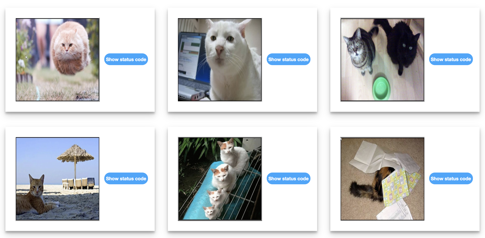

# HTTP Status Cats
Refactoring given HTML into Handlebars templates to represent each cat card block on it's own. Rendered in div with id "allCats"

    
    
    
    
    

## Handlebars Template 

    

## File Structure 
    📦cats-http-status
    ┣ 📂images
    ┣ 📜README.md
    ┣ 📜catSeeder.js
    ┣ 📜cats.html
    ┣ 📜handlebars.min.js
    ┣ 📜style.css
    ┗ 📜template.js

## Showing status codes

    

